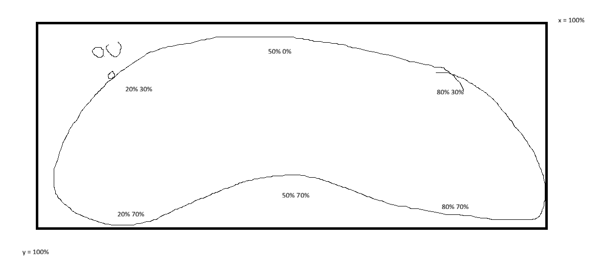
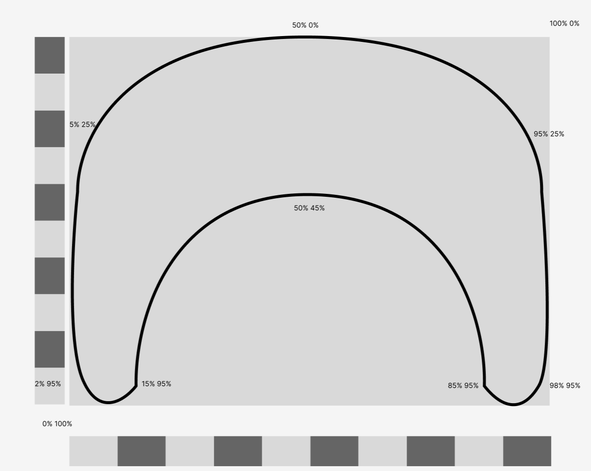

# Melvin-Web_CSS
## Dag 1: 18 - 2 - 2026 Introductie
Ik moest gaan werken aan het Make-up gedeelte van CSS. Hier vallen onder andere shapes onder. Ik wilde hier dus mee gaan oefenen om vormen mee te maken. Dit kan ik namelijk later ook gebruiken voor mijn eigen website die ik gedurende de minor bij ga houden. Op die andere website wilde ik namelijk veel verschillende controllers doen, in tegenstelling tot de enkele controlle die ik had voor mijn persoonlijke website in de kick-off weken. Sommige van deze controllers hebben niet alleen de standaard vierkant en ronde vormen. Daarom wilde ik daar mee gaan oefenen tijdens deze opdracht. Ik had voor mezelf voorgenomen dat ik ik ging proberen om een gamecube controller te maken. Ik denk niet dat het er super goed uit gaat komen te zien, of uberhaupt af komt. Maar dan heb ik er wel mee geoefend.<br><br>

Ik was eerst gewoon een beetje documentatie aan het lezen en dingen aan het proberen. Maar kwam er niet echt uit, daarna ben ik eerst de dingen gaan namaken uit de voorbeeldwebsites die op DLO stonden. Door hier een beetje mee te spelen kreeg ik een beetje idee van hoe het werkte en kon ik er zelf mee gaan spelen. Ik was eerst begonnen met de controller. Ik probeerde hem eerst op te delen in stukken, beginnend met het midden gedeelte want die leek me het makkelijkst. Dit lukte redelijk, ik heb veel inspiratie van de vlag code gebruikt om deze te maken.


Daarna ging ik eerst bezig met sommige andere onderdelen en knoppen om meer te spelen met de verschillende vormen. Zo had ik een octagon gemaakt voor een joystick en heb ik een plusje gemaakt voor de dpad. Deze gingen vrij snel af. Daarna ging ik werken aan de X en Y knoppen. Deze hebben een beetje de vorm van een boon. Het was even gedoe voordat deze goed werkte maar uiteindelijk zien ze er nu wel redelijk uit.



Omdat ik nu wat meer ervaring heb met clip-path: path en clip-path: shape, wilde ik proberen om misschien de controller in 1x te maken, in plaats van losse onderdelen. Ik besloot hier met clip-path: shape te werken zodat ik hem later eventueel nog groter of kleiner makkelijker kon maken. Ik had hem eerst even in Figma geschets zodat ik makkelijker de percentages af kon lezen. Daarna heb ik hem in code gezet en hier en daar nog een beetje de waardes veranderd zodat hij er beter uit ziet. Ik ben tevreeden met het resultaat.

```
#controller-shape {
    background: var(--controller-color);
    width: 520px;
    height: 300px;
    /* clip-path: path("M0 60 Q250 0 500 60 L500 240 Q250 200 0 240 Z"); */
    clip-path: shape(
            /* Startpunt */
            from 5% 25%,

            /* Start to top midden */
            curve to 50% 0% with 15% 0,

            /* Top midden naar rechtsboven */
            curve to 95% 25% with 85% 0,

            /* Rechtsboven naar rechtsonder */
            curve to 98% 95% with 100% 60%,

            /* Rechtsonder naar rechter handheld */
            curve to 85% 95% with 91.5% 100%,

            /* Rechter handheld naar midden center */
            curve to 50% 45% with 75% 40%,

            /* Midden center naar linker handheld */
            curve to 15% 95% with 25% 40%,

            /* linker handheld naar linksonder */
            curve to 2% 95% with 8.5% 100%,

            /* Linksonder naar Start */
            curve to 5% 25% with 0% 60%,

            close
        )
}

```




### Interessante websites
https://bennettfeely.com/clippy/
https://css-tricks.com/css-blob-recipes/
https://css-shape.com/
https://css-generators.com/blob/
https://developer.chrome.com/blog/css-shape?hl=nl
https://frontendmasters.com/blog/understanding-css-corner-shape-and-the-power-of-the-superellipse/

### Inspiratie / hulp
https://cdn.prod.website-files.com/5b44edefca321a1e2d0c2aa6/5e5f3b54311da41f4689a476_Dimensions-Guide-Digital-Video-Game-Controllers-GameCube-Controller-Dimensions.svg
https://upload.wikimedia.org/wikipedia/commons/a/a5/GameCube_controller.png

### Checkout met Groepje + Sanne
Tijdens de checkout hebben we even kort uitgelegd waar we aan hebben gewerkt en hoe de presentatie van morgen eruit komt te zien. Hierin waren we nog even wat dieper in gegaan op hsl en rgba. Hier had Sanne nog even een duidelijk voorbeeld van gegeven van wat het verschil is als je bijvoorbeeld een gradient gebruikt. Dit was goed om te zien. Morgen kunnen we nog even testen hoeveel we te vertellen hebben zodat we niet te kort of te lang aan het praten zijn. Zelf heb ik vandaag in ieder geval veel geleerd over clip-path: path en clip-path: shape. Samen met verschillende corner-shapes.

## Dag 2: 19 - 2 - 2026
### Presentaties
Onze eigen presentatie vond ik vrij goed gaan, ik kon vrij goed vertellen over wat ik had gedaan en kon de code goed uitleggen. Ik had alleen wat moeite met de sneltoetsen op een macBook. Van de andere presentaties vond ik zelf die van de :has vrij interessant. Het lijkt me namelijk vrij handig om tijdens het CSS vak om heel goed te worden in selectors. Die van scoll-driven animations was ook interessant, want ik wil wel meer met animaties gaan werken. Maar die techniek gaat waarschijnlijk niet werken in het idee voor mijn website gedurende de minor.

### Eindopdracht
Vandaag kregen we een kick-off over de eindopdracht van CSS. Hierin mag je kiezen welke opdracht je wilde doen. In eerste instantie wilde ik die van de rubrix cube doen. Het leek me namelijk leuk om te experieenteren met 3D objecten in CSS. Hiervoor moest ik eerst een wiskundig vraagstuk oplossen die Sanne gaf. Ik kreeg er eentje over 12 munten waarvan eentje zwaarder of lichter is en je hebt een weegschaal die je maar 3 keer mag gebruiken (volgens Sanne een van de moeilijkste vraagstukken). Na veel moeite was het gelukt om de vraag correct te beantwoorden, dus mocht ik de rubrix gaan doen. Na veel nadenken en kijken naar hoeveel tijd ik heb. Leek het me handiger om toch maar die van Silly Walk te gaan doen en daar een game thema aan te geven. Dan kan ik namelijk wel nog de 3D cursus doen en dat gebruiken voor mijn NES controller die ik uiteindelijk wil gaan maken. Die is namelijk het meeste een kubus, dus die zou nog wel moeten lukken. <br>

### Checkout met Iris
Tijdens de checkout heb ik mijn idee tot nu uitgelegd. Mijn idee tot nu is dat het een gameachtig karakter wordt waarbij je elk ledemaat los kan besturen. Uit de checkout kwam vooral dit waarschijnlijk gewoon een combinatie van divs en spans worden. Voor de rest weet ik nog niet zeker of ik echt letterlijk een game karakter na ga maken of het alleen gaat laten voelen als het een game is. Ik wil ieder geval dat je hem redelik kan besturen met WASD en pijltjes toetsen, maar dat je hem ook met de muis op kan pakken in een soort ragdoll modus. 

## Week 1 verslag
Deze week ben ik begonnen met CSS met het leren over MakeUp voor een website. Hierin heb ik zelf gefocust op het leren van vormen maken door middel van clip-path: shape() en verschillende corner-shapes. Dit vond ik een interessant onderwerp en kan ik zeker gaan gebruiken voor in de toekomst gaan gebruiken voor verschillende elementen en zelfs animaties aan toeveogen. Vooral voor het maken van mijn verschillende controllers gaat dit helpen. Een ander onderdeel wat ik interessant vond was het gedeelte over hsl. Want op die manier kan je veel mooiere, fellere kleuren creeëren en ziet het er vooral beter uit bij het maken van een gradiënt. Tijdens de presentatie vond ik vooral het stuk over :has interessant, want het lijkt me best handig en leuk om goed te worden in CSS selectors.<br><br>
Voor mijn eigen opdracht wilde ik eerst de rubix kubus gaan maken om te oefenen met 3D objecten. Na het oplossen van het wiskunde probleem van Sanne en het onderzoek naar hoe ik zoiets zou kunnen maken met alleen CSS, viel me de moed een beetje in de schoenen. Vooral als ik keek naar hoeveel werkdagen ik nog maar had. Het leek me dus handiger om iets te kiezen wat meer realistisch was om af te krijgen en dat dan perfect af te ronden en dat ik er nog een beetje easter eggs en details aan toe kon voegen. Ik heb dus gekozen om de Silly Walk opdracht te gaan doen. Hierbij heb ik voor me gevoel meer vrijheid in hoe ik de opdracht vorm kan geven, wat ik fijn vind want dat geeft me meer motivatie om er aan te werken. Er zijn veel loop games waarin je met redelijk lastige controls vooruit moet proberen te komen, dit ziet er vaak klunzig uit. Dit leek me dus perfect om zoiets te proberen te gaan maken door middel van HTML en CSS. Het voorbeeld dat ik in mijn hoofd hiervoor had was Octodad, er staat een plaatje daarvan hieronder. Ik heb nog niet veel schetsen of dingen uitgewerkt, maar dat komt na/ tijdens de vakantie waarschijnlijk.


### Voortgangsgesprek week 1
Nested divs
Anchoring positions with transform difficulties, check online (or ask Sanne)
Julia Miosenne, Make your CSS walk
sibling index on MDN for the joints
min max calculator 9elements

perspective property, mostly around 800 - 1000px 
Only works on direct children