# Melvin-Web_CSS

## Week 1

### Dag 1: 18 - 2 - 2026 Introductie
Ik moest gaan werken aan het Make-up gedeelte van CSS. Hier vallen onder andere shapes onder. Ik wilde hier dus mee gaan oefenen om vormen mee te maken. Dit kan ik namelijk later ook gebruiken voor mijn eigen website die ik gedurende de minor bij ga houden. Op die andere website wilde ik namelijk veel verschillende controllers doen, in tegenstelling tot de enkele controlle die ik had voor mijn persoonlijke website in de kick-off weken. Sommige van deze controllers hebben niet alleen de standaard vierkant en ronde vormen. Daarom wilde ik daar mee gaan oefenen tijdens deze opdracht. Ik had voor mezelf voorgenomen dat ik ik ging proberen om een gamecube controller te maken. Ik denk niet dat het er super goed uit gaat komen te zien, of uberhaupt af komt. Maar dan heb ik er wel mee geoefend.<br><br>

Ik was eerst gewoon een beetje documentatie aan het lezen en dingen aan het proberen. Maar kwam er niet echt uit, daarna ben ik eerst de dingen gaan namaken uit de voorbeeldwebsites die op DLO stonden. Door hier een beetje mee te spelen kreeg ik een beetje idee van hoe het werkte en kon ik er zelf mee gaan spelen. Ik was eerst begonnen met de controller. Ik probeerde hem eerst op te delen in stukken, beginnend met het midden gedeelte want die leek me het makkelijkst. Dit lukte redelijk, ik heb veel inspiratie van de vlag code gebruikt om deze te maken.


Daarna ging ik eerst bezig met sommige andere onderdelen en knoppen om meer te spelen met de verschillende vormen. Zo had ik een octagon gemaakt voor een joystick en heb ik een plusje gemaakt voor de dpad. Deze gingen vrij snel af. Daarna ging ik werken aan de X en Y knoppen. Deze hebben een beetje de vorm van een boon. Het was even gedoe voordat deze goed werkte maar uiteindelijk zien ze er nu wel redelijk uit.

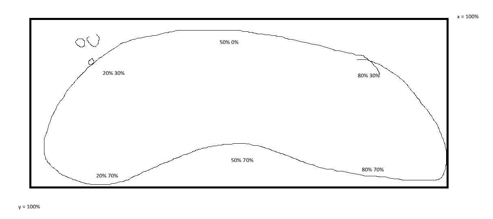

Omdat ik nu wat meer ervaring heb met clip-path: path en clip-path: shape, wilde ik proberen om misschien de controller in 1x te maken, in plaats van losse onderdelen. Ik besloot hier met clip-path: shape te werken zodat ik hem later eventueel nog groter of kleiner makkelijker kon maken. Ik had hem eerst even in Figma geschets zodat ik makkelijker de percentages af kon lezen. Daarna heb ik hem in code gezet en hier en daar nog een beetje de waardes veranderd zodat hij er beter uit ziet. Ik ben tevreeden met het resultaat.

```
#controller-shape {
    background: var(--controller-color);
    width: 520px;
    height: 300px;
    /* clip-path: path("M0 60 Q250 0 500 60 L500 240 Q250 200 0 240 Z"); */
    clip-path: shape(
            /* Startpunt */
            from 5% 25%,

            /* Start to top midden */
            curve to 50% 0% with 15% 0,

            /* Top midden naar rechtsboven */
            curve to 95% 25% with 85% 0,

            /* Rechtsboven naar rechtsonder */
            curve to 98% 95% with 100% 60%,

            /* Rechtsonder naar rechter handheld */
            curve to 85% 95% with 91.5% 100%,

            /* Rechter handheld naar midden center */
            curve to 50% 45% with 75% 40%,

            /* Midden center naar linker handheld */
            curve to 15% 95% with 25% 40%,

            /* linker handheld naar linksonder */
            curve to 2% 95% with 8.5% 100%,

            /* Linksonder naar Start */
            curve to 5% 25% with 0% 60%,

            close
        )
}

```

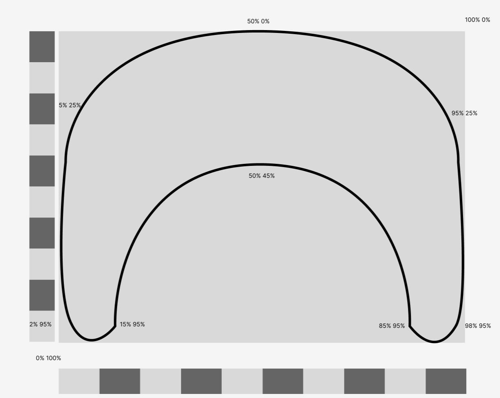
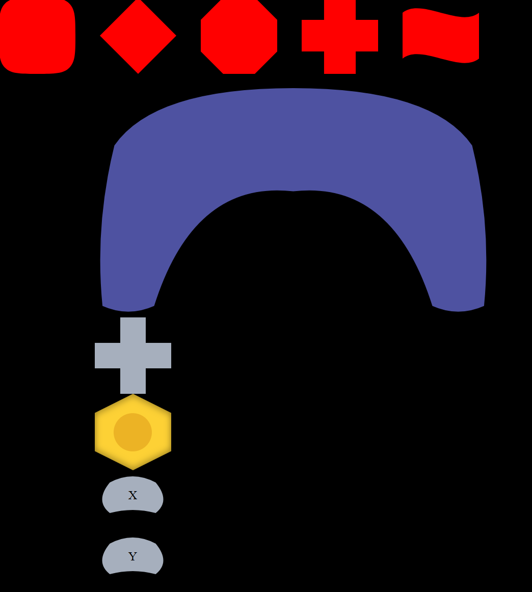

#### Interessante websites
https://bennettfeely.com/clippy/
https://css-tricks.com/css-blob-recipes/
https://css-shape.com/
https://css-generators.com/blob/
https://developer.chrome.com/blog/css-shape?hl=nl
https://frontendmasters.com/blog/understanding-css-corner-shape-and-the-power-of-the-superellipse/

#### Inspiratie / hulp
https://cdn.prod.website-files.com/5b44edefca321a1e2d0c2aa6/5e5f3b54311da41f4689a476_Dimensions-Guide-Digital-Video-Game-Controllers-GameCube-Controller-Dimensions.svg
https://upload.wikimedia.org/wikipedia/commons/a/a5/GameCube_controller.png

#### Checkout met Groepje + Sanne
Tijdens de checkout hebben we even kort uitgelegd waar we aan hebben gewerkt en hoe de presentatie van morgen eruit komt te zien. Hierin waren we nog even wat dieper in gegaan op hsl en rgba. Hier had Sanne nog even een duidelijk voorbeeld van gegeven van wat het verschil is als je bijvoorbeeld een gradient gebruikt. Dit was goed om te zien. Morgen kunnen we nog even testen hoeveel we te vertellen hebben zodat we niet te kort of te lang aan het praten zijn. Zelf heb ik vandaag in ieder geval veel geleerd over clip-path: path en clip-path: shape. Samen met verschillende corner-shapes.

### Dag 2: 19 - 2 - 2026
#### Presentaties
Onze eigen presentatie vond ik vrij goed gaan, ik kon vrij goed vertellen over wat ik had gedaan en kon de code goed uitleggen. Ik had alleen wat moeite met de sneltoetsen op een macBook. Van de andere presentaties vond ik zelf die van de :has vrij interessant. Het lijkt me namelijk vrij handig om tijdens het CSS vak om heel goed te worden in selectors. Die van scoll-driven animations was ook interessant, want ik wil wel meer met animaties gaan werken. Maar die techniek gaat waarschijnlijk niet werken in het idee voor mijn website gedurende de minor.

#### Eindopdracht
Vandaag kregen we een kick-off over de eindopdracht van CSS. Hierin mag je kiezen welke opdracht je wilde doen. In eerste instantie wilde ik die van de rubrix cube doen. Het leek me namelijk leuk om te experieenteren met 3D objecten in CSS. Hiervoor moest ik eerst een wiskundig vraagstuk oplossen die Sanne gaf. Ik kreeg er eentje over 12 munten waarvan eentje zwaarder of lichter is en je hebt een weegschaal die je maar 3 keer mag gebruiken (volgens Sanne een van de moeilijkste vraagstukken). Na veel moeite was het gelukt om de vraag correct te beantwoorden, dus mocht ik de rubrix gaan doen. Na veel nadenken en kijken naar hoeveel tijd ik heb. Leek het me handiger om toch maar die van Silly Walk te gaan doen en daar een game thema aan te geven. Dan kan ik namelijk wel nog de 3D cursus doen en dat gebruiken voor mijn NES controller die ik uiteindelijk wil gaan maken. Die is namelijk het meeste een kubus, dus die zou nog wel moeten lukken. <br>

#### Checkout met Iris
Tijdens de checkout heb ik mijn idee tot nu uitgelegd. Mijn idee tot nu is dat het een gameachtig karakter wordt waarbij je elk ledemaat los kan besturen. Uit de checkout kwam vooral dit waarschijnlijk gewoon een combinatie van divs en spans worden. Voor de rest weet ik nog niet zeker of ik echt letterlijk een game karakter na ga maken of het alleen gaat laten voelen als het een game is. Ik wil ieder geval dat je hem redelik kan besturen met WASD en pijltjes toetsen, maar dat je hem ook met de muis op kan pakken in een soort ragdoll modus. 

### Week 1 verslag
Deze week ben ik begonnen met CSS met het leren over MakeUp voor een website. Hierin heb ik zelf gefocust op het leren van vormen maken door middel van clip-path: shape() en verschillende corner-shapes. Dit vond ik een interessant onderwerp en kan ik zeker gaan gebruiken voor in de toekomst gaan gebruiken voor verschillende elementen en zelfs animaties aan toeveogen. Vooral voor het maken van mijn verschillende controllers gaat dit helpen. Een ander onderdeel wat ik interessant vond was het gedeelte over hsl. Want op die manier kan je veel mooiere, fellere kleuren creeëren en ziet het er vooral beter uit bij het maken van een gradiënt. Tijdens de presentatie vond ik vooral het stuk over :has interessant, want het lijkt me best handig en leuk om goed te worden in CSS selectors.<br><br>
Voor mijn eigen opdracht wilde ik eerst de rubix kubus gaan maken om te oefenen met 3D objecten. Na het oplossen van het wiskunde probleem van Sanne en het onderzoek naar hoe ik zoiets zou kunnen maken met alleen CSS, viel me de moed een beetje in de schoenen. Vooral als ik keek naar hoeveel werkdagen ik nog maar had. Het leek me dus handiger om iets te kiezen wat meer realistisch was om af te krijgen en dat dan perfect af te ronden en dat ik er nog een beetje easter eggs en details aan toe kon voegen. Ik heb dus gekozen om de Silly Walk opdracht te gaan doen. Hierbij heb ik voor me gevoel meer vrijheid in hoe ik de opdracht vorm kan geven, wat ik fijn vind want dat geeft me meer motivatie om er aan te werken. Er zijn veel loop games waarin je met redelijk lastige controls vooruit moet proberen te komen, dit ziet er vaak klunzig uit. Dit leek me dus perfect om zoiets te proberen te gaan maken door middel van HTML en CSS. Het voorbeeld dat ik in mijn hoofd hiervoor had was Octodad, er staat een plaatje daarvan hieronder. Ik heb nog niet veel schetsen of dingen uitgewerkt, maar dat komt na/ tijdens de vakantie waarschijnlijk.

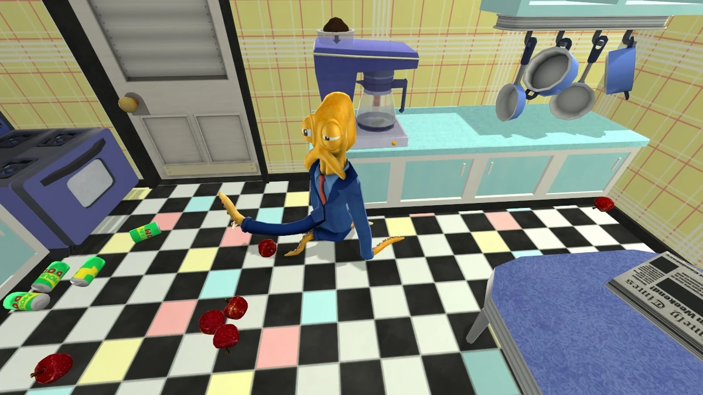

### Voortgangsgesprek week 1
Ik had mijn voortgangsgesprek met Nils. Hij vond mijn idee van een soort OctoDad parody leuk en goed passen bij de opdracht. Hij gaf als tip om nested divs te gebruiken voor de armen en benen. Voor de rest had hij nog wat goede informatie over websites die ik misschien handig zou vinden. Zo andere het werk van Julia Miosenne. Maar ook een pagina op MDN voor sibling index voor de scharnieren in het lichaam. Daarbij gaf hij nog wat informatie voor responsiveness die ik wel handig vond. Dat was de minmax calculator van 9elements. Hierop kan je makkelijk en snel uitzoeken welke waardes je nodig hebt voor fonts als die je die goed responsive wil maken.<br><br>
Ook had hij nog wat informatie gegeven over hoe je dingen 3D kan laten lijken. Hier gaf hij een voorbeeldje van in een codepen. Hij verteelde dat je voor de perspective property meestal rond de 800 tot 1000 pixels zou moeten zitten en dat het alleen werkt op direct children. Ik weet niet of ik dit nodig ga hebben voor mijn huidige opdracht, maar zal zeker in de toekomst helpen.

## Week 2

### Dag 3: 4 - 3 - 2026
Weekly Nerd van Nils - 1 uur
HTML setup gemaakt - 0,5 uur
Layout basics van Nils - 1 uur
3D transforms van Sanne - 1 uur
Met Nils praten over joints - 1 uur
Inspiratie uit zijn codepen voor armen maken - 1,5 uur

Vandaag begonnen we samen met de Weekly Nerd over Nils, deze duurde ongeveer een uur. Daarna had ik kort even tijd om een begin te maken aan mijn eindopdracht. Hier was ik vooral begonnem met het opzetten van mijn html. Ik wist dat ik nested divs moest gebruiken, maar ik kreeg al snel geen overzicht meer. Daarna had ik workshop over layout basics van Nils. Ik dacht in eerste instantie dat dit ging over de layout/ structuur van je HTML en CSS, maar het ging over flexboxes en grid. Hier had ik al aardig wat verstand van, maar ik heb wel nog even iets geleerd over de flex property, van welke 3 properties die combineert en hoe je elke van die kan beïnvloeden en wat ze doen. Direct daarna had ik een workshop van Sanne over 3D (transforms) Deze vond ik een stuk interessanter. Ik had nog nooit met 3D gewerkt dus alles hier was nieuw. Ik wilde namelijk 3D gebruiken voor 1 van mijn controllers voor mijn eindwebsite voor de minor, dus ik moet nog even kijken welke informatie uit deze workshop ik daar wel en niet voor kan gebruiken. Beide workshop duurde ongeveer een uur per stuk. Daarna was ik zelfstandig verder aan het gaan met mijn eigen website maar kwam al snel vast te zitten met de scharnieren voor divs. Nils heeft hier veel bij geholpen en heeft me geholpen wat meer overzicht te krijgen in mijn HTML en CSS code. Ik kan namelijk best goed een header gebruiken voor het hoofd en een footer voor de beter, dat gaat al veel helpen bij het overzicht in mijn HTML. Daarbij kan ik ook data-types gebruiken voor de verschillende onderdelen. Maar hij herinnerde mij er even aan dat er meerdere container elementen in HTML zijn die ik zou kunnen gebruiken ipv van alleen divs. Daarbij heeft hij ook veel geholpen met het maken van de scharnieren voor armen en benen. Hier kon ik daarna goed verder mee. Tijdens het gesprek was er een codepen gemaakt die hij had doorgestuurd.<br>
https://codepen.io/enbee81/pen/KwgVxbo?editors=1100 <br>

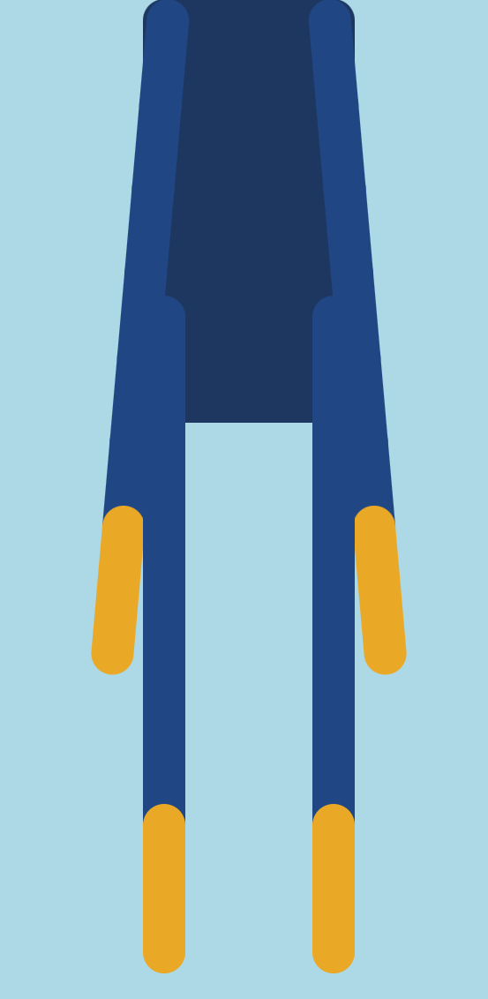

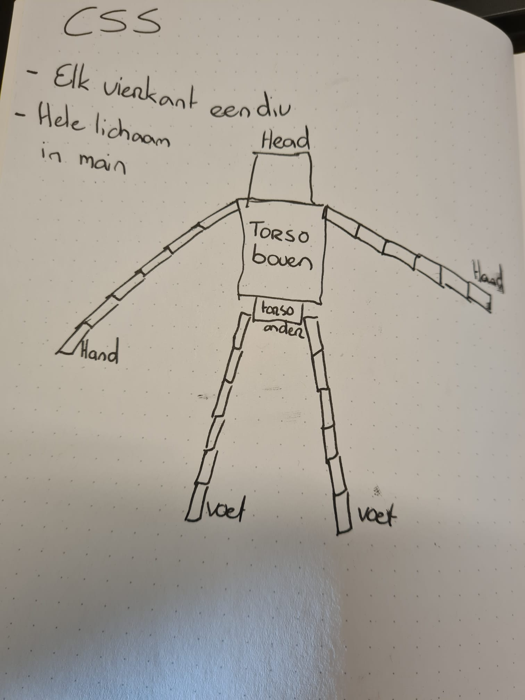
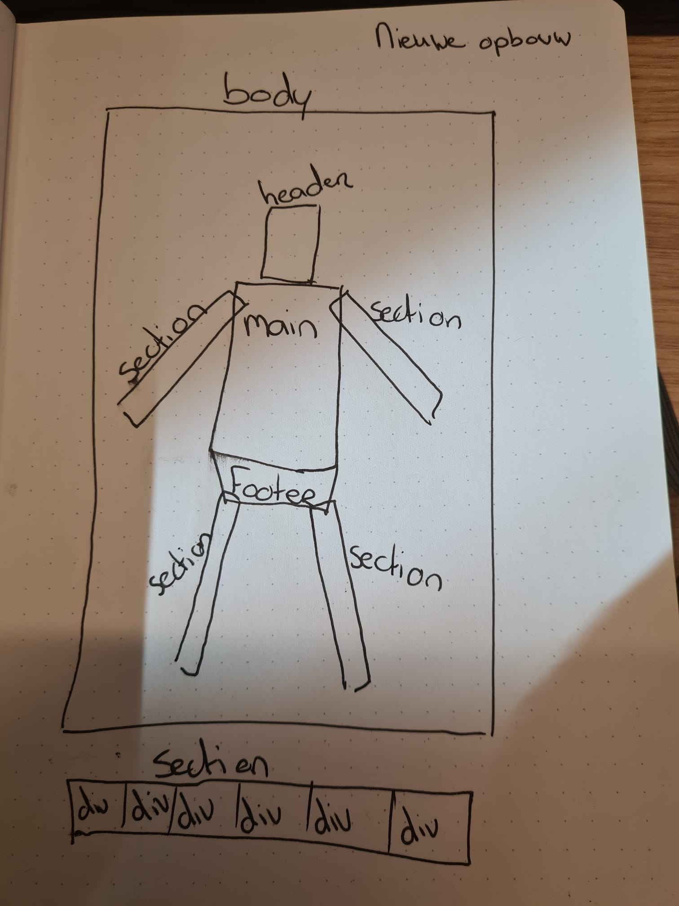


#### Oude HTML code
```     
Hele Lichaam 
    <main>
        Torso Lichaam 
        <div>
            BovenTorso
            <div>
                Shirt
                <div>
                    Stropdas
                    <div></div>
                </div>

                Hoofd
                <div></div>

                Arm Links
                <div>
                    <div>
                        <div>
                            <div>
                                <div>
                                    <div>
                                        Hand
                                        <div>
                                            LHand
                                        </div>
                                    </div>
                                </div>
                            </div>
                        </div>
                    </div>
                </div>

                Arm Rechts
                <div>
                    <div>
                        <div>
                            <div>
                                <div>
                                    <div>
                                        Hand
                                        <div>
                                            RHand
                                        </div>
                                    </div>
                                </div>
                            </div>
                        </div>
                    </div>
                </div>
            </div>
            OnderTorso
            <div>
                Been Links
                <div>
                    <div>
                        <div>
                            <div>
                                <div>
                                    <div>
                                        <Voet
                                        <div>

                                        </div>
                                    </div>
                                </div>
                            </div>
                        </div>
                    </div>
                </div>

                Been Rechts
                <div>
                    <div>
                        <div>
                            <div>
                                <div>
                                    <div>
                                        Voet
                                        <div>

                                        </div>
                                    </div>
                                </div>
                            </div>
                        </div>
                    </div>
                </div>
            </div>
        </div>

    </main>
```
#### Oude CSS
```
body {
    width: 100vw;
    height: 100vh;
    background: seagreen;
    display: flex;
    justify-content: center;
    align-content: center;
}

div {
    width: 3em;
    height: 3em;
}

/* Lichaam */
main {
    margin: auto;
}

/* Torso */
main > div {
    background: yellow;
    width: 10em;
    height: 15em;
}

/* BovenTorso */
main > div > div:first-child {
    background: red;
    width: inherit;
    height: 70%;
}

/* Hele LinkerArm */
main > div > div:first-child > div:nth-child(3) {
    background: var(--color-suit);
    position: relative;
    transform-origin: 50% 10%;
}

/* Elk onderdeel van de linker arm */
main > div > div:first-child > div:nth-child(3) div {
    background: var(--color-suit);
    width: 2em;
    height: 6em;
    position: relative;
    transform-origin: 50% 10%;
}

Linker Hand */
main > div > div:first-child > div:nth-child(3) div:not(:has(div)) {
    background: var(--color-skin);
    width: 1.5em;
    aspect-ratio: 1/5;
} */

/* Hele RechterArm */
main > div > div:first-child > div:nth-child(4) {
    position: relative;
    transform-origin: 50% 10%;
}

main > div > div:first-child > div:nth-child(4) div {
    background: var(--color-suit);
}

/* Rechter Hand */
main > div > div:first-child > div:nth-child(4) div:not(:has(div)) {
    background: var(--color-skin);
    height: 100px;
    width: 20px;
}

/*  OnderTorso */
main > div > div:nth-child(2) {
}

/* LinkerBeen */
main > div > div:nth-child(2) > div:first-child {
}

/* LinkerBeen */
main > div > div:nth-child(2) > div:first-child {
}

/* LinkerVoet */
main > div > div:nth-child(2) > div:first-child div:not(:has(div)) {
    background: var(--color-skin);
}

/* RechterBeen */
main > div > div:nth-child(2) > div:last-child {
}

/* Rechtervoet */
main > div > div:nth-child(2) > div:last-child div:not(:has(div)) {
    background: var(--color-skin);
} 
```

#### Daily Checkout met Naoufai
Naoufai gaat een control panel maken in de vorm van een retro radio. Hij had nog niet veel gedaan qua functionaliteiten maar was vooral een beetje bezig geweest met styling zei hij. Het zag er wel al redelijk uit zoals in het plaatje dat hij als voorbeeld had. Hij had leuke ideeën voor muzieknoten die dan uit de radio kwamen. Dat bracht me op ideeën om bijvoorbeeld iets met bubbels te doen die je kan poppen. Voor de rest had we het nog even kort over mijn thema gehad dat ik misschien iets kan doen met een onderwater en bovenwater thema en dat het gezicht van het poppetje dan veranderd alsof hij in paniek is.

### Dag 4: 5 - 6 - 2026
Vandaag begonnen met een gezamelijk gesprek waarin we andere CSS moesten bestuderen en kregen we vragen over specificity. Dat was best leuk, duurde ongeveer een uur. Daarna ben ik zelfstandig gaan werken tot mijn workshop. Tijdens het zelfstandig werken ben ik bezig geweest met het stylen van mijn poppetje. Zodat hij eruit komt te zien als het karakter dat ik na probeer te maken. Ik begon met zijn overhemd onder zijn pak en zijn stropdas. Voor beide onderdelen had ik gebruik gemaakt van een polygon generator. Ik moest alleen nog een beetje met de waardes spelen zodat het er goed uitzag en dat de stropdas dan niet buiten het pak zou vallen. Daarna ging ik bezig met de handen. Deze had ik in Figma weer eerst uitgetekend zodat ik makkelijker alle percentages kon bekijken voor de clip-path. Dit heb ik later ook gedaan voor de snor en het hoofd. Tijdens de workshop heb ik geleerd over anchor positioning. Dit zal ik vast wel eens kunnen gebruiken, maar misschien niet in het huidge project. De workshop duurde ongeveer een half uurtje en het zelfstandig werken daarvoor 2 uur. Ns de workshop ging ik verder met het stylen van mijn poppetje. Nu ging ik beginnen aan het hoofd. Hier moest ik eerst nog wat HTML voor schrijven, maar dat was niet veel. Daarna had ik van het hoofd en snor een clip-path gemaakt in Figma zodat ik die makkelijker kon maken in CSS. Dat hielp veel. Daarna ging ik bezig met de ogen. Tijdens de workshop vandaag kwam kort even ::before en ::after naar voren. Dit bracht me op ideeën om dat te gebruiken voor de ogen. Dat werkte goed! Ik ben zeer tevreden over het resultaat. Tussendoor had ik nog even met Nils gepraat over een mechanic die ik later wil gaan maken voor mijn thema. Dat het achtergrond water veranderd adhv de breedte van je scherm. Hier had hij alvast wat uitleg over gegeven omdat hij er morgen en volgende week niet is. Daarna had ik nog tijd over dus had ik alvast een begin gemaakt aan de animatie op de benen. Ik wilde ze niet gelijk hebben. Het is nog niet helemaal hoe ik het voor ogen had, maar voor nu is het goed genoeg. Als allerlaatste heb ik nog even een tekst met font toegevoegd zodat ik dat morgen bij het voortgangsgesprek kan laten zien. Het zelfstandig werken duurde 3 uur.

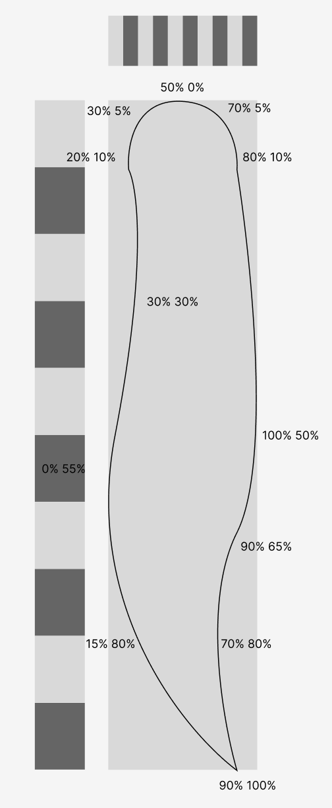
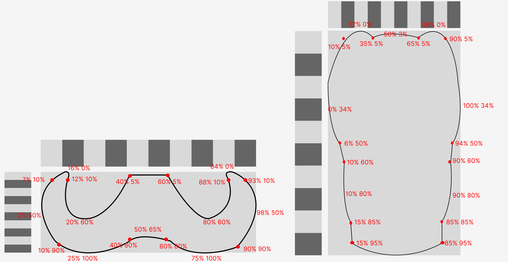
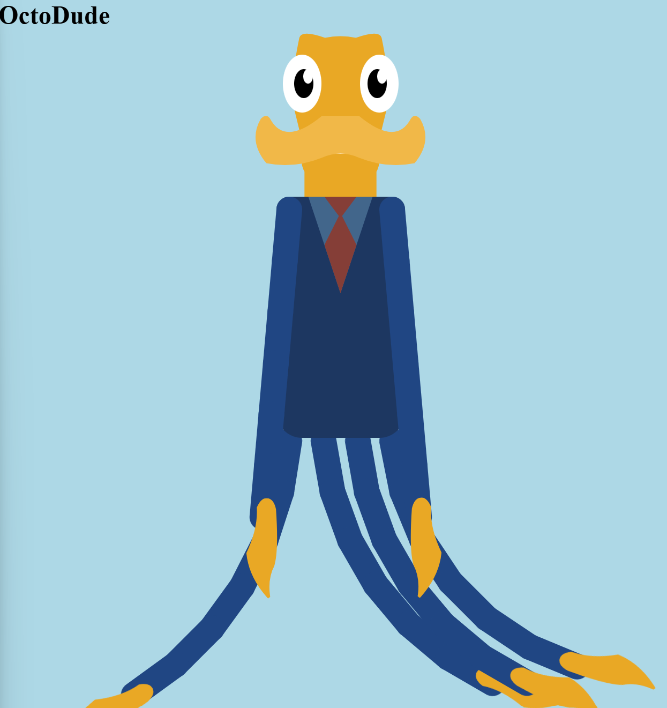

#### Inspiratie afbeeldingen
https://images.steamusercontent.com/ugc/468674753085237580/A99D5775804483659464E5E0615DD74216CDC168/?imw=512&&ima=fit&impolicy=Letterbox&imcolor=%23000000&letterbox=false

#### Bekeken websites
https://chrome.dev/anchor-tool/<br>
https://bennettfeely.com/clippy/<br>

#### Daily Checkout met Diego
Uit deze checkout kwam niet. De dingen waar ik nog aan moest beginnen, had ik nog niet echt geprobeerd, dus wist niet of ik daar vast mee zou lopen. We hebben het wel even gehad over de dingen waar hij mee vast liep. Hij kwam wel op een nieuwe idee dat hij zou gaan testen / proberen.

### Week 2 verslag
Deze week ben ik echt begonnen met het coderen van mijn eindopdracht. Ik was begonnen met op papier schetsen hoe de layout er ongeveer uit kwam te zien en kwam er toen achter hoeveel divs ik eigenlijk wel niet nodig zou hebben. Later had Nils me geholpen om een betere setup te gebruiken waarin ik ook andere container elementen gebruik zoals sections, de header en de footer. Dit bracht meteen veel meer overzicht in mijn code. Nils had ook geholpen met de joints van de divs in de arm. Dit hielp heel veel. Hierdoor kon ik de dag daarna meteen al aan de slag met de styling van mijn poppetje. Zo heb ik deze week ook de volledige styling van mijn poppetje zelf al af gekregen en heb ik de komende 2 weken nog de tijd voor animaties, easter eggs en typografie. Voor een paar onderdelen van de styling had ik clip-paths gebruikt, iets wat ik aan het begin van het CSS vak had geleerd. Ik merk dat ik daar al meer behendig in wordt. Ook heb ik nog een idee van hoe ik 2 thema's kan toevoegen aan mijn website. Ik heb hier kort met Nils al over gehad omdat ik een bepaalde formule nodig had, ik moet nog even kijken of het me lukt om dit te maken. Ik had tijdens een workshop hadden we het ook nog een keer over ::before en ::after gehad. Ik had hier wel al eerder van gehoord, maar begreep het nooit heel goed waardoor ik het nooit echt had gebruikt. Nu begrijp ik hem beter en had ik hem meteen ook gebruikt om de ogen van mijn poppetje te maken.

### Vrijdag 6 - 3 - 2026
Vandaag heb ik ook nog even iets gedaan aan mijn CSS project. Ik ben begonnen aan het water niveau laten stijgen en dalen. Ik had eerst onderzoek gedaan op de website van Nils om te kijken naar het berekenen van de breedte van het scherm en dat te combineren aan de hoogte van het water level. Dit kreeg ik werkend, daarna heb ik AI gevraagd om er wat limieten op te zetten om ervoor te zorgen dat het water niveau niet pas op 100vh is bij 0px breedte. TOen ik op school kwam heb ik een clip-path geschreven voor de golven in het water en heb ik er een opacity op gezet en z-index verhoogt. Dan lijkt het namelijk echt alsof de octopus uit het water kwam. Vasilis raadde aan op mix-blend-mode te gebruiken, maar we waren het er allebei over eens dat opacity misschien een betere oplossing was. Daarna ben ik gaan kijken naar if(). Het duurde even voordat ik deze begreep en kon gebruiken voor bepaalde effecten op mijn website. Maar kreeg het al werkend voor de ogen en de mond van de octobpus zodra het water niveau een bepaalde vh had.

#### Bekeken websites
https://developer.mozilla.org/en-US/docs/Web/CSS/Reference/Values/if
https://9elements.com/blog/speed-vs-duration-a-use-case-for-mixed-unit-division/

#### Ai Hulp
Propmt:
Yeah you are messing things up. Since with that new code it didnt work. Could you try to still use the old code with atan tan formula. There just seems to be a slight error in some of the calculations. I believe the water level is max at 0px wide. But the screen will never get to that point. Plus the water level is already at 0vh when the screen is 900px wide. While most screens are wider than that. Think you can fix that using the following code?
```
:root {
    --color-water: #2389da;
    --color-sand: #ffd06f;

    --100vw: 100vw;
    --px-width: tan(atan2(var(--100vw), 1px));

    /* limits */
    --min-width: 350;
    --max-width: 1500;
    --range: 1150;

    /* normalized progress 0→1 */
    --progress: calc((var(--px-width) - var(--min-width)) / var(--range));

    /* convert to vh */
    --water-level: calc((1 - var(--progress)) * 100vh);
}

body::after {
    content:"";
    background: var(--color-water);
    position: absolute;
    bottom: 0;
    left: 0;
    right: 0;
    z-index: -2;

    height: clamp(0vh, var(--water-level), 100vh);
}
```

#### Voortgangsgesprek
Tijdens het voortgangsgesprek heb ik mijn website laten zien en bijna alles was al goed. Het enige waar ik nog echt even naar moest kijken was mijn typografie. De font past wel al bij mijn website. Maar hij was nog niet sensationeel genoeg. Hier ga ik dus nog even naar kijken zodat ik hem beter kan maken. Voor nu is het idee om elke letter los te doen en er met ::before en ::after badeendjes van te maken die dobberen op het water niveau.

## Week 3

### Woensdag 11 - 3 - 2026
Vandaag begonnen we met een uitleg over kleuren van Sanne van ongeveer een uurtje. Daarna ben ik de rest van de dag verder zelfstandig gaan werken. Ik begon met een if schrijven voor de kleur van het hoofd van de octopus. Hier had ik een box-shadow voor. De box-shadow had ik al, maar de if alleen nog niet, dit was dan dus ook wel snel klaar. Daarna ben ik verder gegaan met het maken van de typografie. Hiervoor had ik eerst in Figma een design gemaakt voor een badeend en voor een snavel. Hiervoor had ik een voorbeeld gebruikt van: https://www.shutterstock.com/shutterstock/photos/395200873/display_1500/stock-vector-rubber-duck-ducky-bath-toy-line-art-vector-icon-for-apps-and-websites-395200873.jpg. Hierdoor kon ik hem daarna makkelijker in CSS namaken. Het maken van de badeendjes ging redelijk gemakkelijk. Het enige wat me nog niet gelukt was was ze responsive maken, maar Sanne vertelde later dat het ook niet per se hoefde. Hier ben ik ongeveer 2 uur mee bezig geweest. Eerst had ik alleen een p met een ::before en een ::after voor het lichaam en had ik een span als child voor een eventuele hoed. Later heb ik nog een extra span toegevoegd voor een oog. Ik had ook nog een extra if nodig voor de benen van de octopus. Zodra het scherm dan te groot zou worden dat ook de benen droog komen te liggen, zouden ze enorm gaan spartelen. Dit was redelijk snel werkend omdat ik nu al wat meer ervaring met if() had. <br>
Het laatste waar ik vandaag mee bezig was geweest waren de armen. Ik had een idee om radio buttons over het scherm heen te doen en dat de arm dan naar de locatie van de geklikte radio button zou gaan. Ik had dit aan Cyd voorgesteld, maar die verwees me al redelijk snel door naar Sanne. Sanne stelde voor om anchor positioning te gebruiken en had hier een snelle schets voor gemaakt en wat linkjes naar codepens gegeven. Hier kwam ik een klein eindje mee. Het lukte me om een anchor te maken, maar die werkte alleen op radio buttons die boven de schouder zaten. Alles daaronder zorgt er namelijk voor dat het anchor element een negatieve height krijgt en daardoor niet bestaat. Hier ben ik voor de rest van de dag niet uitgekomen.

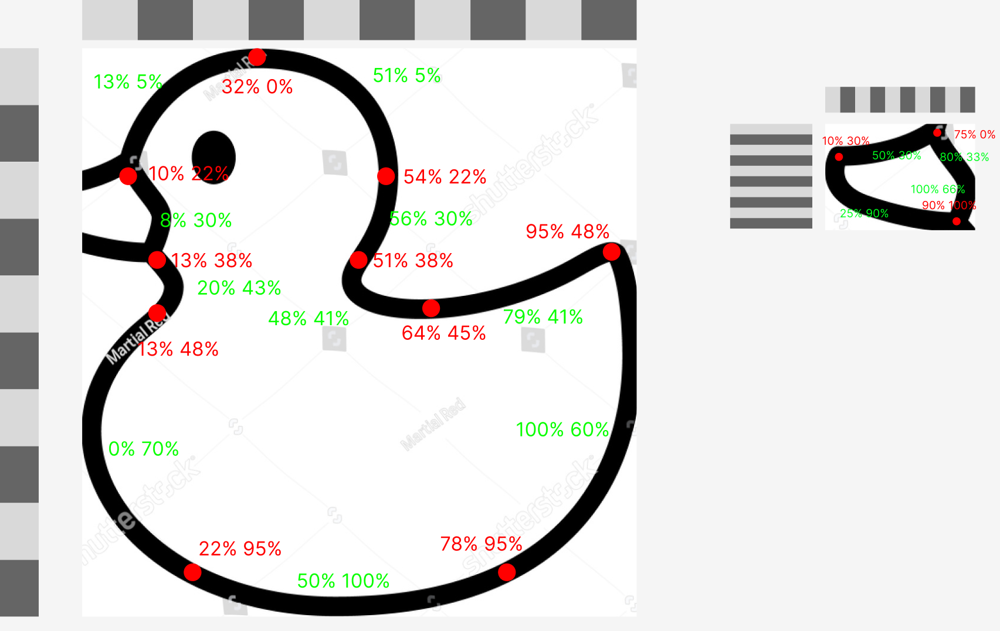
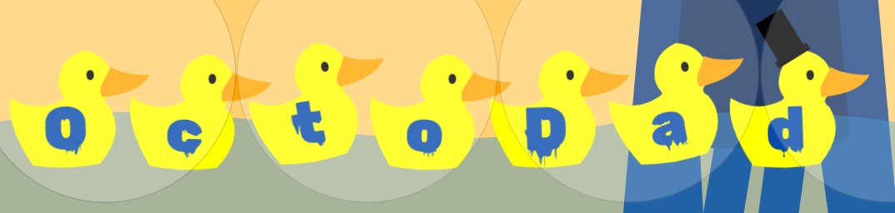
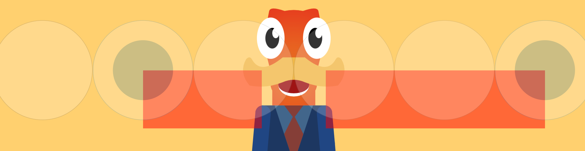

#### Websites
https://codepen.io/shooft/pres/QwWJbEX?editors=1100<br>
https://frontendmasters.com/blog/how-to-get-the-width-height-of-any-element-in-only-css/<br>
https://codepen.io/Melvin-Vermast/pen/wBzGgEV?editors=1100<br>
https://codepen.io/shooft/pres/QwWzzXB?editors=1100<br>
https://www.corner-shape.com/<br>

#### Checkout met

 